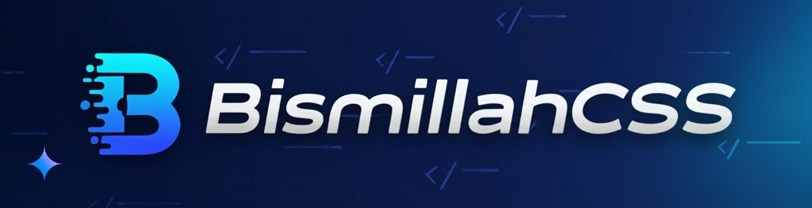

[](https://www.npmjs.com/package/bismillahcss)  
[](https://github.com/BismillahCSS/bismillahcss-framework/blob/main/LICENSE)  
[](https://www.npmjs.com/package/bismillahcss)  
[](https://github.com/BismillahCSS/bismillahcss-framework)

---

## Introduction

**BismillahCSS** is a utility-first CSS framework designed to simplify and accelerate the development of modern, responsive, and customizable web applications. Inspired by the principles of utility-first frameworks like TailwindCSS, BismillahCSS provides a lightweight and flexible solution for developers who want to build beautiful and functional UIs without the overhead of traditional CSS frameworks.

---

## Features

- **Utility-First Approach**: Build your UI with pre-defined utility classes.
- **Lightweight**: Minimal CSS footprint for faster load times.
- **Customizable**: Easily extend and override styles to fit your needs.
- **Responsive Design**: Built-in responsive utilities for mobile-first development.
- **Modern CSS**: Leverages the latest CSS features for advanced styling.
- **Dark Mode Support**: Built-in support for light and dark themes.
- **Open Source**: Free to use and contribute.

---

## Installation

### Using npm
```bash
npm install bismillahcss
```

### Using CDN
Add the following link to your HTML file:
```html
<link rel="stylesheet" href="https://cdn.jsdelivr.net/npm/bismillahcss/dist/bismillah.min.css">
```

---

## Getting Started

### Basic Usage
To use BismillahCSS, simply include the CSS file in your project and start using the utility classes in your HTML.

```html
<div class="bg-primary text-white p-4 rounded-lg shadow-lg">
    <h1 class="text-3xl font-bold">Welcome to BismillahCSS</h1>
    <p class="text-lg">A utility-first CSS framework for modern web development.</p>
</div>
```

### Customization
You can customize BismillahCSS by overriding the default CSS variables in your project.

```css
:root {
    --primary-color: #3498db;
    --secondary-color: #2ecc71;
    --accent-color: #e74c3c;
    --bg-color: #f8f9fa;
    --text-color: #333;
    --border-radius: 8px;
    --font-family: "Inter", sans-serif;
}
```

---

## Responsive Design

BismillahCSS provides responsive utilities for building mobile-first designs. Use the following breakpoints:

- `sm`: Small devices (max-width: 640px)
- `md`: Medium devices (max-width: 768px)
- `lg`: Large devices (max-width: 1024px)
- `xl`: Extra-large devices (max-width: 1280px)

Example:
```html
<div class="p-4 md:p-8 lg:p-12">
    <h1 class="text-xl md:text-2xl lg:text-3xl">Responsive Heading</h1>
</div>
```

---

## Utility Classes

### Colors
```html
<div class="bg-primary text-white">Primary Background</div>
<div class="bg-secondary text-white">Secondary Background</div>
<div class="bg-accent text-white">Accent Background</div>
```

### Spacing
```html
<div class="p-4 m-4">Padding and Margin</div>
<div class="px-2 py-4">Horizontal and Vertical Padding</div>
```

### Typography
```html
<h1 class="text-4xl font-bold">Heading</h1>
<p class="text-lg text-gray-700">Paragraph</p>
```

### Flexbox
```html
<div class="flex items-center justify-between">
    <div>Item 1</div>
    <div>Item 2</div>
</div>
```

### Grid
```html
<div class="grid grid-cols-3 gap-4">
    <div>Grid Item 1</div>
    <div>Grid Item 2</div>
    <div>Grid Item 3</div>
</div>
```

---

## Dark Mode

BismillahCSS supports dark mode out of the box. Use the `data-theme="dark"` attribute to enable dark mode.

```html
<body data-theme="dark">
    <div class="bg-dark text-light p-4">
        <h1>Dark Mode Enabled</h1>
    </div>
</body>
```

---

## Advanced Features

### Glassmorphism
```html
<div class="glass p-6 rounded-lg shadow-lg">
    <h1 class="text-2xl font-bold">Glassmorphism Card</h1>
</div>
```

### Animations
```html
<div class="animate-bounce">Bouncing Element</div>
<div class="animate-fade-in">Fading In Element</div>
```

### Buttons
```html
<button class="btn btn-primary">Primary Button</button>
<button class="btn btn-secondary">Secondary Button</button>
```

---

## Contributing

We welcome contributions from the community! If you'd like to contribute to BismillahCSS, please follow these steps:

1. Fork the repository.
2. Create a new branch for your feature or bug fix.
3. Commit your changes and push them to your fork.
4. Submit a pull request to the main repository.

---

## License

BismillahCSS is licensed under the [MIT License](https://github.com/mubashir-dev/bismillahcss/blob/main/LICENSE).

---

## Author

Developed by **Mubashir Ali**.  
[GitHub](https://github.com/mubashir-dev) | [Twitter](https://twitter.com/mubashir_dev)

---

## Links

- [Documentation](https://github.com/mubashir-dev/bismillahcss/docs)
- [GitHub Repository](https://github.com/mubashir-dev/bismillahcss)
- [NPM Package](https://www.npmjs.com/package/bismillahcss)

---

## Acknowledgments

Special thanks to the open-source community for inspiring the creation of BismillahCSS.

---
```