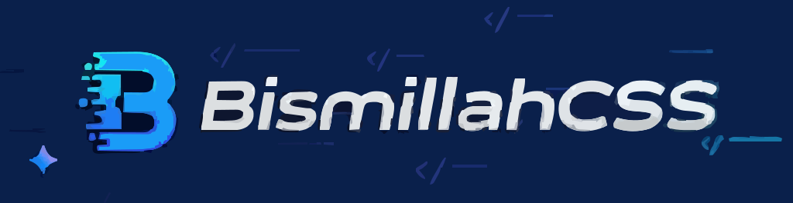

<a href="https://www.npmjs.com/package/bismillahcss">
    
</a>

<div align="center">
  <a href="https://www.npmjs.com/package/bismillahcss">
    
  </a>
  <a href="https://github.com/BismillahCSS/bismillahcss-framework/blob/main/LICENSE">
    
  </a>
  <a href="https://www.npmjs.com/package/bismillahcss">
    
  </a>
  <a href="https://github.com/BismillahCSS/.github/tree/main/profile">
    
  </a>
</div>


<h1>INTRODUCTION</h1>

<p align="left">
  A utility-first CSS framework for rapidly building custom user interfaces.
</p>


#  Core Features

- **Utility-First Approach**: Build custom designs without leaving your HTML.
- **Responsive Design**: Mobile-first responsive components and utilities.
- **Dark Mode Support**: Built-in dark mode with automatic detection.
- **Modern Effects**: Glassmorphism, neon effects, and more.
- **Customizable**: Easy to customize with CSS variables.
- **Lightweight**: Minimal file size with no JavaScript dependencies.


# Installation
#### Using npm
```bash
npm install bismillahcss
```

### Manual Download
[](https://www.npmjs.com/package/bismillahcss)


## Base Styles

BismillahCSS includes a set of base styles and variables that provide a solid foundation for your projects.

### Color Variables
```css
:root {
    --bismillah-primary-color: #3498db;
    --bismillah-secondary-color: #2ecc71;
    --bismillah-accent-color: #e74c3c;
    --bismillah-bg-color: #f8f9fa;
    --bismillah-text-color: #333;
    --bismillah-border-radius: 8px;
    --bismillah-font-family: 'Inter', sans-serif;
}
```

### Dark Mode
BismillahCSS automatically detects system preferences for dark mode:
```css
@media (prefers-color-scheme: dark) {
    :root {
        --bismillah-bg-color: #121212;
        --bismillah-text-color: #ffffff;
    }
}
```


This README provides a comprehensive overview of the BismillahCSS framework.

```html
<head>
    <meta charset="UTF-8">
    <meta name="viewport" content="width=device-width, initial-scale=1.0">
    <title>NeoFuture Tech</title>
    <link rel="stylesheet" href="https://cdn.jsdelivr.net/npm/bismillahcss/dist/bismillah.min.css">
</head>
<body>
    <nav class="bismillah-flex bismillah-justify-between bismillah-items-center bismillah-p-4 bismillah-shadow-lg bismillah-bg-dark">
        <span class="bismillah-futuristic-font bismillah-text-primary bismillah-text-2xl">NeoFuture</span>
        <div class="bismillah-flex bismillah-gap-5">
            <a href="#home" class="bismillah-text-light bismillah-hover-text-primary">Home</a>
            <a href="#features" class="bismillah-text-light bismillah-hover-text-primary">Features</a>
        </div>
    </nav>
    <section id="home" class="bismillah-flex bismillah-flex-col bismillah-justify-center bismillah-items-center bismillah-p-10 bismillah-min-h-screen hero-bg">
        <h1 class="bismillah-text-5xl bismillah-font-extrabold bismillah-futuristic-font">
            <span class="bismillah-text-primary">Neo</span><span class="bismillah-text-accent">Future</span>
        </h1>
        <p class="bismillah-text-xl bismillah-mb-5">Pioneering the next generation of digital experiences.</p>
        <button class="bismillah-btn-primary bismillah-p-4 bismillah-rounded">Explore Now</button>
    </section>
    <section id="features" class="bismillah-bg-dark bismillah-p-10">
        <h2 class="bismillah-text-3xl bismillah-font-bold bismillah-text-center bismillah-futuristic-font bismillah-text-primary">Revolutionary Features</h2>
        <div class="bismillah-grid bismillah-grid-cols-1 bismillah-md-grid-2 bismillah-lg-grid-3 bismillah-gap-8">
            <div class="bismillah-card-glass bismillah-p-6 bismillah-rounded-lg">
                <h3 class="bismillah-text-xl bismillah-font-bold bismillah-futuristic-font">Quantum Processing</h3>
                <p>Break traditional computing barriers with quantum efficiency.</p>
            </div>
            <div class="bismillah-card-glass bismillah-p-6 bismillah-rounded-lg">
                <h3 class="bismillah-text-xl bismillah-font-bold bismillah-futuristic-font">Neural Interface</h3>
                <p>Enable thought-controlled interactions with advanced neural systems.</p>
            </div>
        </div>
    </section>
</body>
</html>
```

### Key Features
- **Hero Section**: A visually stunning introduction with futuristic design.
- **Navbar**: Responsive navigation with hover effects.
- **Cards**: Glassmorphism cards showcasing features.
- **Buttons**: Interactive buttons with hover animations.


```html
<!DOCTYPE html>
<html lang="en">
<head>
    <meta charset="UTF-8">
    <meta name="viewport" content="width=device-width, initial-scale=1.0">
    <title>BismillahCSS</title>
    <link rel="stylesheet" href="https://cdn.jsdelivr.net/npm/bismillahcss/dist/bismillah.min.css">
</head>
<body>
    <div class="bismillah-hero">
        <div class="bismillah-hero-text">
            <h1>Build Faster with BismillahCSS</h1>
            <p>A lightweight and flexible utility-first CSS framework.</p>
            <button class="bismillah-btn">Get Started</button>
        </div>
        
        
        <div class="bismillah-testimonials">
            <p> "BismillahCSS made my workflow 10x faster!" - Developer</p>
        </div>
    </div>
    
</body>
</html>
```


Developed by **Mubashir Ali**.  

<p >
<a href="https://github.com/bismillahcss" target="_blank">
    
</a>
<a href="https://www.linkedin.com/in/mubashirali3/" target="_blank">
    
</a>
</p>


## Links

- [GitHub Repository](https://github.com/BismillahCSS/)
- [NPM Package](https://www.npmjs.com/package/bismillahcss)

---

## Acknowledgments

Special thanks to the open-source community for inspiring the creation of BismillahCSS.

---
